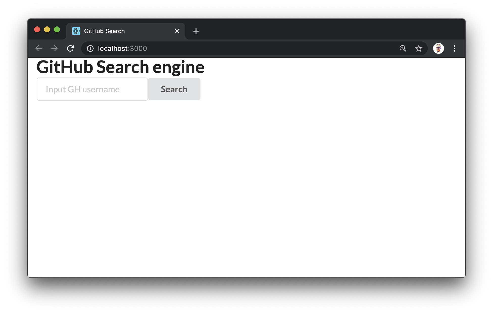

## Midcourse Exam Challenge - GitHub User Search

You are challenged with creating a feature that allows the users to search the GitHub registry of users.

We have prepared the basic user interface for you. Your task is to make a call to the GitHub API and retrieve information on whatever the user inputs in the search field.

You will fork this repository and then clone down the forked repository to your local computer. Then you need to branch off before you start with the actual challenge. When you feel that you are done, make a pull request towards this repository.

Once you feel that you are finished with the coding challenge you need to open up the `writtenExam.md` and answer the question there.



### Resources
- GitHub API Documentation: https://developer.github.com/v3/
- More on searching for users: https://developer.github.com/v3/search/#search-users
- Postman: https://www.postman.com/

### Tests
This repository has been equipped with Cypress for E2E tests. You will get extra scores for adding component tests (using Jest and Enzyme)

To run the test suite, execute:
```
$ yarn cypress
```

### Example response
The search for "Barack" yields the following results:
```json
{
    "total_count": 163,
    "incomplete_results": false,
    "items": [
        {
            "login": "barack",
            "id": 681626,
            "node_id": "MDQ6VXNlcjY4MTYyNg==",
            "avatar_url": "https://avatars3.githubusercontent.com/u/681626?v=4",
            "gravatar_id": "",
            "url": "https://api.github.com/users/barack",
            "html_url": "https://github.com/barack",
            "followers_url": "https://api.github.com/users/barack/followers",
            "following_url": "https://api.github.com/users/barack/following{/other_user}",
            "gists_url": "https://api.github.com/users/barack/gists{/gist_id}",
            "starred_url": "https://api.github.com/users/barack/starred{/owner}{/repo}",
            "subscriptions_url": "https://api.github.com/users/barack/subscriptions",
            "organizations_url": "https://api.github.com/users/barack/orgs",
            "repos_url": "https://api.github.com/users/barack/repos",
            "events_url": "https://api.github.com/users/barack/events{/privacy}",
            "received_events_url": "https://api.github.com/users/barack/received_events",
            "type": "User",
            "site_admin": false,
            "score": 1.0
        },
        {
            "login": "PresidentObama",
            "id": 10196880,
            "node_id": "MDQ6VXNlcjEwMTk2ODgw",
            "avatar_url": "https://avatars3.githubusercontent.com/u/10196880?v=4",
            "gravatar_id": "",
            "url": "https://api.github.com/users/PresidentObama",
            "html_url": "https://github.com/PresidentObama",
            "followers_url": "https://api.github.com/users/PresidentObama/followers",
            "following_url": "https://api.github.com/users/PresidentObama/following{/other_user}",
            "gists_url": "https://api.github.com/users/PresidentObama/gists{/gist_id}",
            "starred_url": "https://api.github.com/users/PresidentObama/starred{/owner}{/repo}",
            "subscriptions_url": "https://api.github.com/users/PresidentObama/subscriptions",
            "organizations_url": "https://api.github.com/users/PresidentObama/orgs",
            "repos_url": "https://api.github.com/users/PresidentObama/repos",
            "events_url": "https://api.github.com/users/PresidentObama/events{/privacy}",
            "received_events_url": "https://api.github.com/users/PresidentObama/received_events",
            "type": "User",
            "site_admin": false,
            "score": 1.0
        },
        {
            "login": "shentibeitaokongle",
            "id": 22750197,
            "node_id": "MDQ6VXNlcjIyNzUwMTk3",
            "avatar_url": "https://avatars0.githubusercontent.com/u/22750197?v=4",
            "gravatar_id": "",
            "url": "https://api.github.com/users/shentibeitaokongle",
            "html_url": "https://github.com/shentibeitaokongle",
            "followers_url": "https://api.github.com/users/shentibeitaokongle/followers",
            "following_url": "https://api.github.com/users/shentibeitaokongle/following{/other_user}",
            "gists_url": "https://api.github.com/users/shentibeitaokongle/gists{/gist_id}",
            "starred_url": "https://api.github.com/users/shentibeitaokongle/starred{/owner}{/repo}",
            "subscriptions_url": "https://api.github.com/users/shentibeitaokongle/subscriptions",
            "organizations_url": "https://api.github.com/users/shentibeitaokongle/orgs",
            "repos_url": "https://api.github.com/users/shentibeitaokongle/repos",
            "events_url": "https://api.github.com/users/shentibeitaokongle/events{/privacy}",
            "received_events_url": "https://api.github.com/users/shentibeitaokongle/received_events",
            "type": "User",
            "site_admin": false,
            "score": 1.0
        }
    ]
}
```

### Your exam
The facilitator will inform you how much time you have to complete the task. You are free to use any resources you deem necessary. We will observe your workflow as well as assess the quality of your code and tests.

Good luck!
